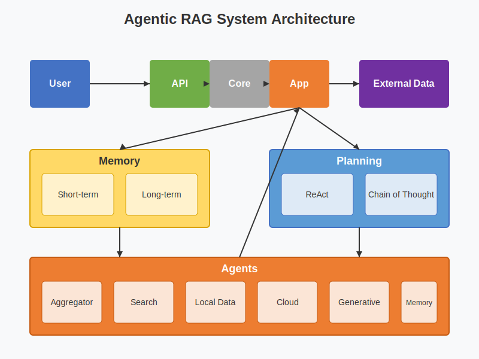

# Agentic RAG

A modular, production-ready Retrieval-Augmented Generation system with agentic capabilities.

## Overview

Agentic RAG extends traditional Retrieval-Augmented Generation by incorporating autonomous agents that can interact with various data sources to provide comprehensive responses to user queries. The system uses a modular architecture that allows for easy extension and customization.

## Architecture

Agentic RAG consists of several key components:

- **Core**: Fundamental data models and interfaces
- **Memory**: Short-term and long-term storage for queries and results
- **Planning**: Components for creating execution plans (ReAct, Chain of Thought)
- **Agents**: Specialized modules for retrieving and processing information
  - Aggregator: Combines results from multiple agents
  - Search: Retrieves information from external sources
  - Local Data: Accesses local file systems and databases
  - Cloud: Interacts with cloud services (AWS, Azure, GCP)
  - Generative: Produces human-like responses using language models
  - Memory: Retrieves information from memory components



## Features

- **Multi-source Retrieval**: Integrates information from various sources (web, local data, cloud)
- **Persistent Memory**: Remembers previous queries and results for improved efficiency
- **Adaptive Planning**: Creates and adapts execution plans based on query requirements
- **Modular Design**: Easily extend with new agents, memory components, or planners
- **RESTful API**: Simple HTTP API for integration with other systems
- **Docker Support**: Easy deployment with Docker
- **Comprehensive Logging**: Detailed logs for debugging and monitoring
- **Configuration Management**: Flexible configuration via JSON files and environment variables

## Installation

### Prerequisites

- Python 3.10 or higher
- PostgreSQL (for long-term memory)
- Docker (optional, for containerized deployment)

### Using pip

```bash
# Clone the repository
git clone https://github.com/jaganthoutam/agentic-rag.git
cd agentic-rag

# Create and activate a virtual environment (recommended)
python -m venv venv
source venv/bin/activate  # On Windows: venv\Scripts\activate

# Install dependencies
pip install -r requirements.txt
```

### Using Docker

```bash
# Clone the repository
git clone https://github.com/jaganthoutam/agentic-rag.git
cd agentic-rag

# Build the Docker image
docker build -t agentic-rag .

# Run the container
docker run -p 8000:8000 -v $(pwd)/config.json:/app/config.json agentic-rag
```

## Configuration

The system is configured using a `config.json` file. You can customize various aspects:

```json
{
  "version": "1.0.0",
  "app": {
    "name": "agentic-rag",
    "environment": "development",
    "debug": true
  },
  "logging": {
    "level": "info",
    "format": "json",
    "output": "console",
    "file_path": "logs/agentic-rag.log"
  },
  "api": {
    "host": "0.0.0.0",
    "port": 8000,
    "timeout": 30,
    "cors_origins": ["*"]
  },
  // Memory, planning, and agent configurations...
}
```

For detailed configuration options, see the [Configuration Guide](docs/configuration.md).

## Usage

### Running the API Server

```bash
python api.py
```

The API will be available at `http://localhost:8000`.

### Example Queries

You can use the example script to test the system:

```bash
python examples/example_usage.py
```

### API Endpoints

- `POST /query`: Process a query
- `GET /health`: Check system health
- `GET /stats`: Get system statistics

Example API request:

```bash
curl -X POST http://localhost:8000/query \
  -H "Content-Type: application/json" \
  -d '{"text": "What are the latest developments in AI research?"}'
```

## Extending the System

### Adding a New Agent

1. Create a new class that inherits from `BaseAgent`
2. Implement the `process` method
3. Register the agent in the configuration

```python
from core import AgentType, Query, Document, AgentResult
from agents.base import BaseAgent

class MyCustomAgent(BaseAgent):
    def __init__(self, custom_param: str = "default") -> None:
        super().__init__(agent_type=AgentType.CUSTOM)
        self.custom_param = custom_param
        
    @BaseAgent.measure_execution_time
    def process(self, query: Query) -> AgentResult:
        # Implementation
        documents = [Document(content="Custom result", source="custom_agent")]
        
        return AgentResult(
            agent_id=self.id,
            agent_type=self.agent_type,
            query_id=query.id,
            documents=documents,
            confidence=0.8,
            processing_time=0.0,  # Will be set by decorator
            metadata={"custom_param": self.custom_param}
        )
```

### Adding a New Memory Component

1. Create a new class that inherits from `BaseMemory`
2. Implement the required methods
3. Register the memory in the configuration

For more extension possibilities, see the [Developer Guide](docs/developer_guide.md).

## License

This project is licensed under the MIT License - see the [LICENSE](LICENSE) file for details.

## Acknowledgements

- Inspired by research on Retrieval-Augmented Generation
- ReAct planning approach based on ["ReAct: Synergizing Reasoning and Acting in Language Models"](https://arxiv.org/abs/2210.03629)
- Chain of Thought planning based on ["Chain-of-Thought Prompting Elicits Reasoning in Large Language Models"](https://arxiv.org/abs/2201.11903)
